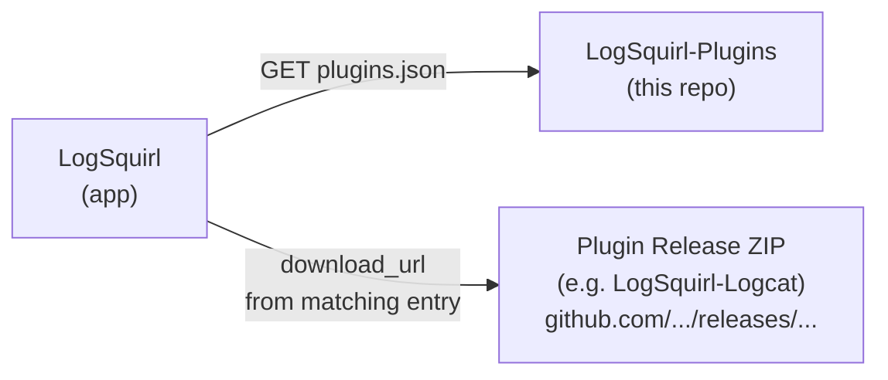

# LogSquirl Plugin Registry

[](https://github.com/64x-lunicorn/LogSquirl-Plugins/actions/workflows/validate.yml)
[](LICENSE)

Central index of available [LogSquirl](https://github.com/64x-lunicorn/LogSquirl)
plugins.  LogSquirl's **Browse Plugins** dialog fetches `plugins.json` from this
repository to list and install plugins with a single click.

> **This repo contains only the plugin index — no plugin source code.**
> Each plugin lives in its own repository and publishes release ZIPs.
> This registry points LogSquirl to those ZIPs.

---

## How It Works



1. LogSquirl downloads `plugins.json` from this repo's `main` branch.
2. The dialog filters entries by platform and `api_version`.
3. User clicks **Install** → the plugin ZIP is downloaded, verified
   (SHA-256), extracted, and loaded automatically.

---

## Adding or Updating a Plugin

All changes go through **pull requests**.  Direct pushes to `main` are not
allowed.

### Step-by-Step

1. **Fork** this repository (or create a branch if you have write access).

2. **Edit `plugins.json`** — add one catalog entry for your plugin:

   ```json
   {
     "id": "io.github.yourname.myplugin",
     "name": "My Plugin",
     "author": "Your Name",
     "description": "Short description of what it does",
     "license": "GPL-3.0-or-later",
     "repo_url": "https://github.com/yourname/myplugin",
     "releases_url": "https://raw.githubusercontent.com/yourname/myplugin/main/releases.json",
     "icon_url": "https://raw.githubusercontent.com/yourname/myplugin/main/icon.png"
   }
   ```

   The catalog holds **one entry per plugin**, not one per version or
   platform. Versions, platforms and checksums live in your own
   `releases.json`, which the host fetches from `releases_url`.

3. **Open a pull request** against `main`.

4. **CI validates** your change automatically:
   - `plugins.json` must be valid JSON
   - `id`, `name`, `description` and `author` must be non-empty strings
   - `id` must be a reverse-DNS identifier: dot-separated lowercase
     alphanumeric segments, at least three of them, **no hyphens**
     (`^[a-z][a-z0-9]*(\.[a-z][a-z0-9]*){2,}$`)
   - `repo_url` and `releases_url` must be HTTPS
   - no duplicate `id` values

5. A maintainer **reviews and merges** the PR.  The updated index is
   live immediately (served via GitHub raw content).

### Publishing a New Version

Nothing changes in this repository. Add the release to your own
`releases.json` and the host picks it up on the next catalog refresh.

### Removing a Plugin

Open a PR that removes your plugin's entry from `plugins.json` and
explain the reason in the PR description.

---

## Entry Schema

`plugins.json` uses `schema_version: 2`:

```json
{
  "schema_version": 2,
  "plugins": [ ... ]
}
```

### Catalog Fields

| Field          | Type     | Required | Description |
|----------------|----------|----------|-------------|
| `id`           | `string` | yes | Reverse-DNS identifier, must match `plugin.json` inside the ZIP |
| `name`         | `string` | yes | Human-readable plugin name |
| `description`  | `string` | yes | One-line description |
| `author`       | `string` | yes | Author name or organization |
| `license`      | `string` | no  | SPDX identifier, e.g. `GPL-3.0-or-later` |
| `repo_url`     | `string` | no  | HTTPS URL of the plugin's repository |
| `releases_url` | `string` | no  | HTTPS URL of the plugin's `releases.json` |
| `icon_url`     | `string` | no  | HTTPS URL of a PNG icon, displayed at 48×48 |

### Release Manifest — `releases.json`

Lives in your own repository. Releases are listed **newest first**; the
host takes the first entry that has an asset for the current platform.

```json
{
  "plugin_id": "io.github.yourname.myplugin",
  "releases": [
    {
      "version": "1.0.0",
      "api_version": 1,
      "release_notes": "What changed in this version",
      "assets": [
        {
          "platform": "macos",
          "download_url": "https://github.com/.../myplugin-1.0.0-macos-arm64.zip",
          "sha256": "e3b0c44298fc1c149afbf4c8996fb92427ae41e4649b934ca495991b7852b855"
        }
      ]
    }
  ]
}
```

`platform` is one of `macos`, `linux`, `windows`.

> [!IMPORTANT]
> Always fill in `sha256`. An **empty string disables verification** — the
> host downloads and installs the archive without checking it. Generate the
> digest from the exact file you upload:
>
> ```bash
> shasum -a 256 myplugin-1.0.0-macos-arm64.zip     # macOS / Linux
> Get-FileHash myplugin-1.0.0-macos-arm64.zip -Algorithm SHA256   # Windows
> ```

### Legacy Schema v1

The host still reads `schema_version: 1`, where every version and platform
is inlined in `plugins.json`. New submissions should use v2.

---


## Official Plugins

| Plugin | Description | Repo |
|--------|-------------|------|
| Android Logcat | Stream Android logcat from ADB-connected devices | [LogSquirl-Logcat](https://github.com/64x-lunicorn/LogSquirl-Logcat) |
| Custom Footer | Extract key-value pairs from logs with regex rules | [LogSquirl-CustomFooter](https://github.com/64x-lunicorn/LogSquirl-CustomFooter) |
| Serial Monitor | Stream serial port data from connected devices | [LogSquirl-Serial](https://github.com/64x-lunicorn/LogSquirl-Serial) |
| tcpdump / pcap Viewer | Render pcap captures as readable packet lists | [LogSquirl-tcpdump](https://github.com/64x-lunicorn/LogSquirl-tcpdump) |

Current versions are listed in each plugin's own `releases.json`.


---

## Repository Structure

```
LogSquirl-Plugins/
├── .github/
│   ├── workflows/
│   │   └── validate.yml          # CI: validates plugins.json on every PR
│   └── PULL_REQUEST_TEMPLATE.md  # PR checklist for plugin submissions
├── .gitignore
├── CONTRIBUTING.md               # Contribution guidelines
├── LICENSE                       # GPL-3.0-or-later
├── README.md                     # This file
└── plugins.json                  # The plugin index (the only file that matters)
```

## License

This repository is licensed under the
[GNU General Public License v3.0 or later](LICENSE).
